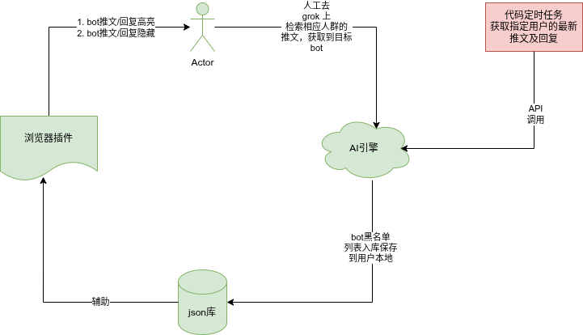
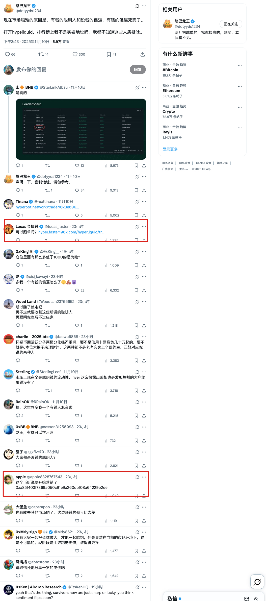
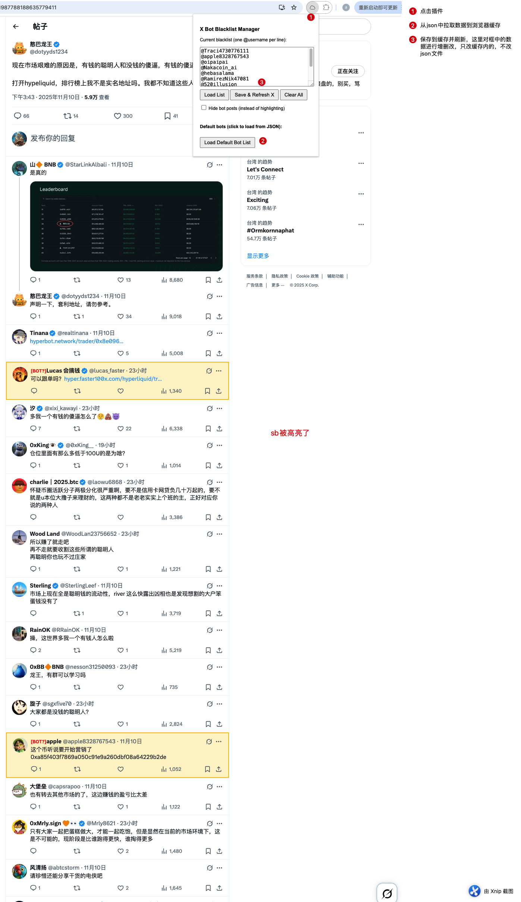
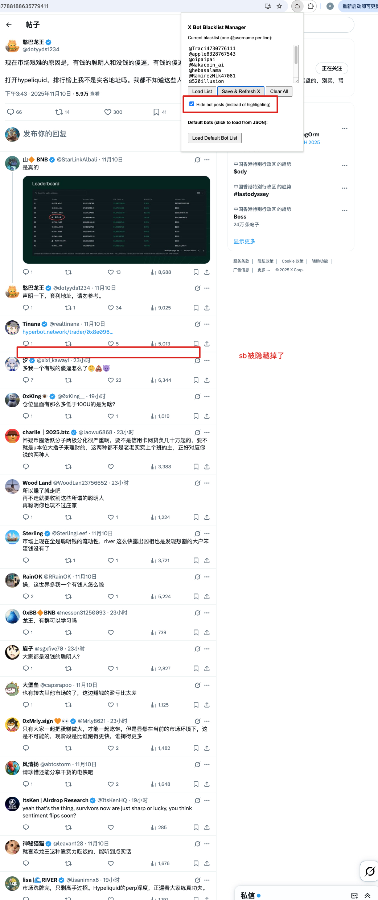

# x_blocker
## 目标
1. block some sb
2. 本地化运行，确保信息安全
3. 屏蔽一下垃圾BOT的垃圾回复


## 总体结构图
```plain
运行逻辑为，从黑名单数据库拉取数据，渲染x页面的时候进行目标用户推文、回复等信息block掉。支持block推文高亮展示 或者 block推文直接隐藏掉

1. 绿色部分已经实现， 主要是通过grok 访问大kol推文及其相应的回复，使用grok来整理出来黑名单，然后手动更新到json文件中
2. 红色部分未实现，通过写代码，定时任务调用AI服务，自动重复第一步，实现自动化更新bot黑名单
3. 点击插件的时候，有选项和按钮，将数据从json文件中load出来加载到了chrome的存储中，提高黑名单访问速度，所以，最好不要随便请缓存

```

__逻辑图__



## 使用
1. 下载到本地独立文件夹内
2. 打开chrome 的插件管理，打开开发者模式，加载相应的插件即可
3. data路径下的blacklist.json 是整个插件的核心，放置着黑名单数据, 参考如下：


```json
{
  "blacklist": [
    "@Traci4730776111",
    "@apple8328767543"
  ]
}
```

4. 点击插件会有高亮垃圾推文和隐藏垃圾推文的选项


## 说明
1. json文件放置在本地，优先考虑的是插件使用人群对网络天然不信任的特征，完全本地化，这是另一种的去中心
2. 将json文件放置在云端，并结合代码逻辑行程服务，那么json文件就是一份卖点，客户端永远不是核心价值，核心价值在于数据，可以做成付费插件，但是部分人群会降低对插件的信任(插件监听剪贴板太容易了，助记词危险了)
3. 可以自己实现红色部分，实现自部署
4. 以龙王的帖子为demo，获取一些乱七八糟的bot，我觉得打败AI的只能是AI，人干不过他们，或者成本太高，有这个时间亏点u不要太爽了(AI产生数据的质量，取决于你提示词的质量， 垃圾进垃圾出的道理)


## 参考
1. 去grok中让grok访问目标kol的推文，找出相应的垃圾bot，写好提示词，不然会有误杀。参考：[简单的检索龙王帖子下的机器人](other/demo.md)
2. 将整理出来的垃圾bot放置到json文件中， 刷新页面即可


__一、开始的页面__


---

__二、高亮垃圾bot的页面__


---

__隐藏垃圾bot的页面__

